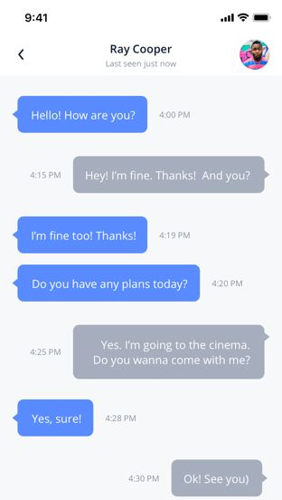

# React Native Messager

This project serves as my React Native learning for the moment.

A React Native based cross-platform messenger(Messager) application.
The themes can be changed in the runtime, without any need of reloading the application.

 

## Key features:
 
- Built with **TypeScript**.
- Integrate with **UIKitten**.
- Integrate SendBird as the back-end messaging service, you can change it with your own/favoured service.
- **Dark and Light themes** could be used simultaneously and changed on the fly. 
- **Huge variety of customizable Themes**.
- **Integration with Eva Design System** allows the app to stay in brand style and get clean, consistency UI.

## License

[MIT](LICENSE.txt) license.
